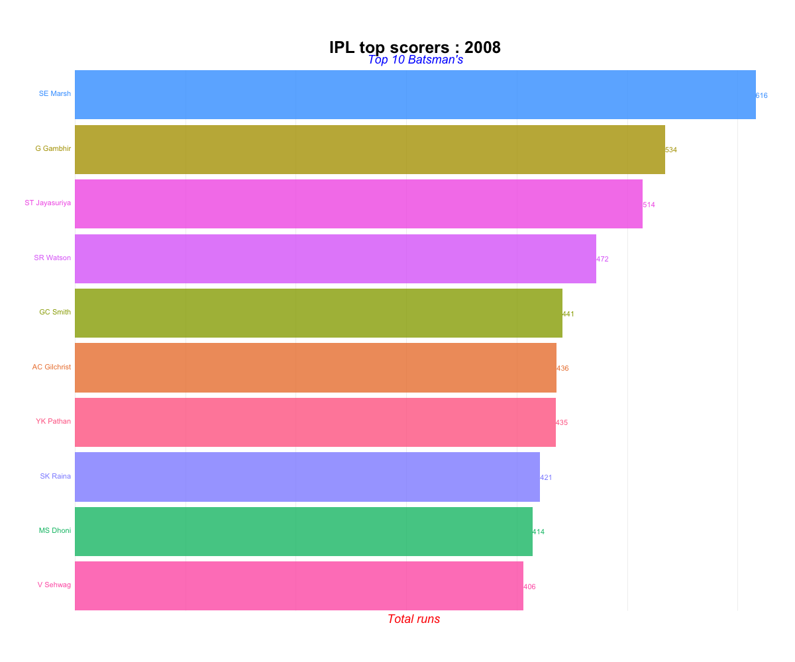

# IPL
This repository is meant to demonstrate time series animation of IPL top run scorers.

# Content
a. data folder contains the data files [IPL dataset: Data till Season 11 (2008 - 2018) Data source - CricSheet.org]. This folder compries of following files:
  1. deliveries.csv : Ball by ball data
  2. matches.csv : Match by match data

b. top_batsmen_ipl.R contains the R script.

# Analysis: Top run scorers across IPL seasons

